# Top 18 AI Video Repurposing Tools Ranked in 2025 (Latest Compilation)

You know that feeling when you spend hours recording a killer podcast or webinar, and then it just sits there? One video, one platform, barely scratching the surface of its potential. That's the problem most content creators face—loads of valuable content trapped in long-form videos, desperate for a second life as bite-sized clips that actually get watched. AI video repurposing tools solve this by automatically extracting engaging moments from your long videos and transforming them into platform-ready shorts for TikTok, Instagram Reels, YouTube Shorts, and LinkedIn.

These tools use AI to analyze your content, identify the most compelling segments, add captions, apply smart cropping, and even generate social media posts—all without you touching a timeline. Whether you're a solo creator drowning in editing work or a marketing team trying to scale content production, the right video repurposing platform can turn one hour of footage into weeks of social media content. Below, we've ranked 18 tools based on features, ease of use, output quality, and real-world performance to help you pick the one that fits your workflow.

***

## **[Munch](https://www.getmunch.com)**

The all-in-one AI platform that turns long videos into dozens of platform-optimized clips with built-in engagement analytics.

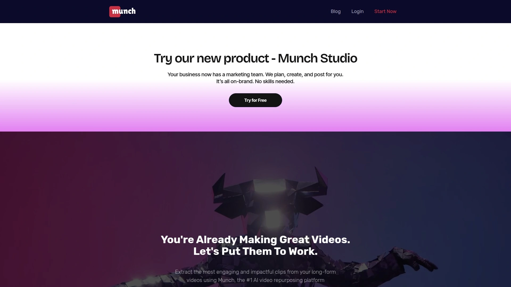

Munch sits at the top because it doesn't just clip your videos—it actually thinks about what will perform. The platform uses GPT, OCR, and natural language processing to extract contextual nuggets from your long-form content, then cross-references them with trending topics and social media engagement patterns from major platforms. This means you're not just getting random cuts; you're getting clips that are more likely to resonate with your audience based on real marketing data.

The auto-cropping keeps speakers centered regardless of platform format, and the instant social post generation feature writes captions tailored for TikTok, Instagram, Twitter, LinkedIn, and YouTube Shorts based on your video's themes. Munch supports over 10 languages, from Spanish and German to Hindi and Japanese, making it ideal for creators with international audiences. Pricing starts at $49/month for 100 minutes, with higher tiers offering up to 500 minutes.

What sets Munch apart is its unified dashboard where you can analyze engagement metrics, control distribution, and manage your entire content repurposing workflow without jumping between tools.

---

## **[Opus Clip](https://www.opus.pro)**

Lightning-fast AI clipper that detects "viral moments" and assigns each clip a virality score.

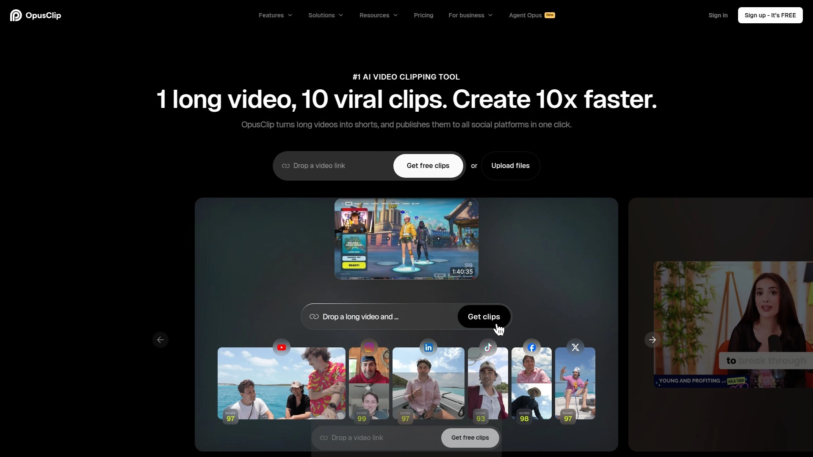

Opus Clip made its name by being stupidly simple to use. You paste a YouTube link or upload a video, click one button, and ChatGPT-powered AI scans the entire thing for high-engagement moments. Each generated clip gets a virality score that predicts how well it might perform on social media—think of it as a confidence meter for your content.

The tool excels at active speaker detection, automatically keeping the current speaker in frame even during multi-person conversations. It also adds AI-generated keyword highlights and emoji overlays to boost engagement without making your clips look cheesy. Opus Clip offers a generous 30-day free trial with 90 minutes of credit and no watermarks, making it one of the easiest tools to test-drive.

**Best for:** Podcasters and interview-style content creators who need quick turnaround. Paid plans start at $19/month for roughly 200 upload minutes and 80 HD clips.

---

## **[Pictory](https://pictory.ai)**

**AI-powered highlight extraction designed for social media teams managing multiple clients.**

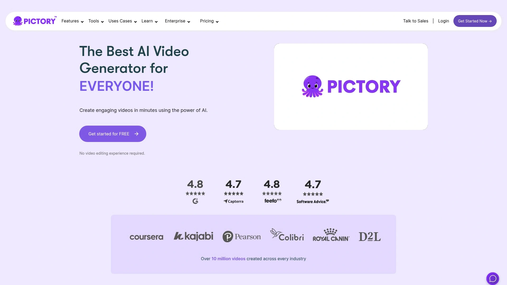

Pictory transforms blog posts, webinars, and long videos into short, entertaining clips for YouTube Shorts, Instagram Reels, and TikTok. What makes it stand out is the script-to-video capability—you can paste a blog link or written script, and Pictory automatically creates a video with matching visuals, captions, and background music.

The platform provides access to millions of royalty-free stock images and video clips through integrations with iStock and Shutterstock, so you're never stuck with boring b-roll. Pictory's AI automatically captures highlights from your recordings and generates captions, enabling fast production even if you have zero editing experience.

Pricing runs $19/month for the Standard plan and $39/month for Premium when billed annually. The tool is particularly useful for marketing assistants and social media managers who need platform-ready videos quickly without spending hours in traditional editing software.

---

## **[Vidyo.ai](https://vidyo.ai)**

Bulk video clipping specialist that converts long podcasts and webinars into multiple short clips with auto-captions.

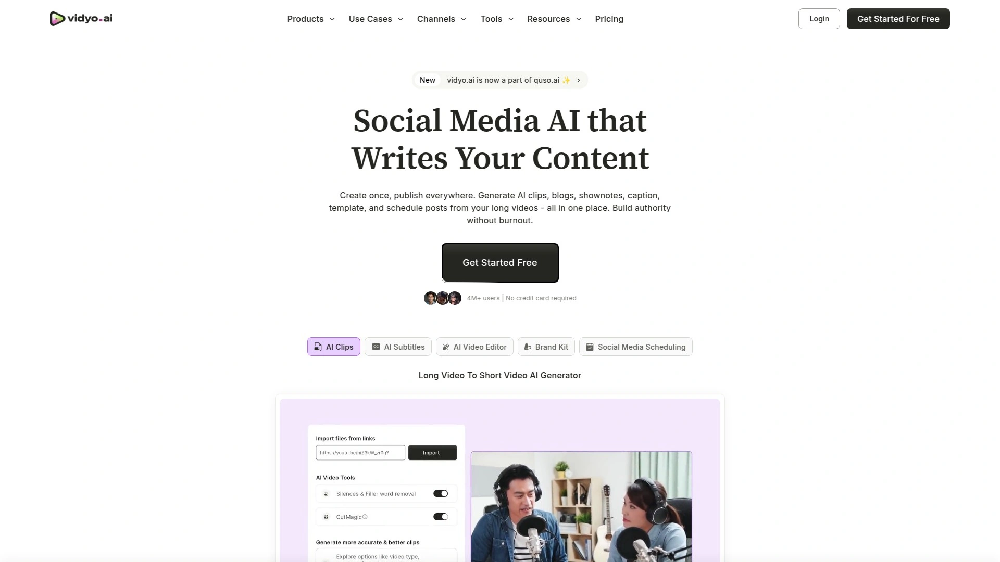

Vidyo.ai (formerly known as Quso.ai) is built for creators who publish frequently and need to batch-process content. Upload a long-form podcast, livestream, or webinar, and the AI identifies the best moments of engagement, automatically crops them to fit vertical formats, and adds captions.

You can generate multiple short clips from a single upload, edit captions, add logos, and export in different aspect ratios for TikTok, Instagram Reels, YouTube Shorts, or LinkedIn—all within the same workflow. Vidyo.ai offers a free tier to get started, with paid plans beginning at $24/month for Lite, $33/month for Essential, and a popular Growth plan also at $33/month.

**Ideal for:** Solopreneurs, podcast hosts, and marketing teams who want to efficiently turn longer videos into multiple short, shareable clips without manual editing.

***

## **[Descript](https://www.descript.com)**

Text-based video editor with Overdub voice cloning and advanced AI editing features.

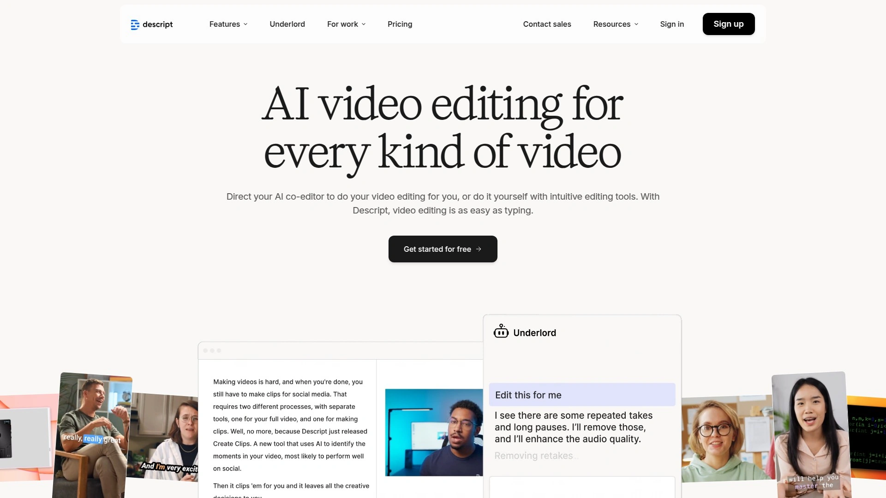

Descript flips video editing on its head by letting you edit videos like a text document. The platform transcribes your footage automatically, and you edit by deleting words, rearranging sentences, or cutting paragraphs—the video adjusts accordingly. This makes it ridiculously fast to remove filler words, awkward pauses, or entire sections without scrubbing through timelines.

The Overdub feature lets you clone your voice using AI, so if you mess up a word or need to add a sentence later, you can type it out and Descript generates it in your voice. For repurposing, Descript can automatically create short clips from long recordings and includes tools like Studio Sound to improve audio quality.

Descript offers a free plan with limited features, and paid plans start at $16/month. It's favored by podcasters, YouTubers, and content creators who value precision editing combined with AI automation.

***

## **[VEED.io](https://www.veed.io)**

All-in-one video creation suite with brand kits, green screen effects, and live streaming support.

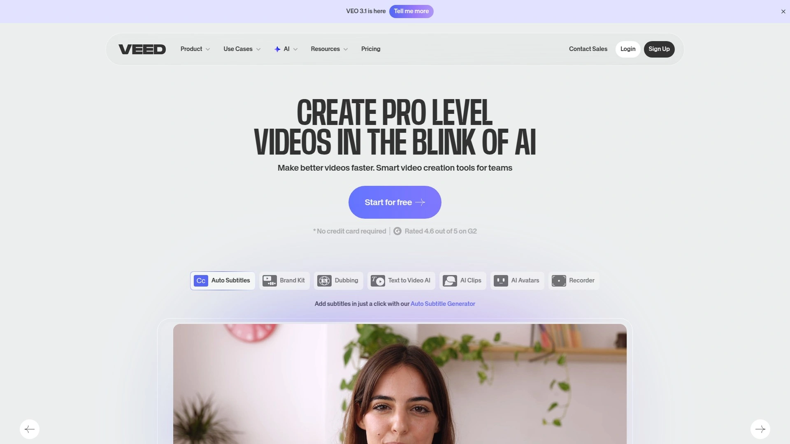

VEED.io positions itself as a complete video production platform rather than just a clipping tool. It includes features like green screen chroma key effects, background removal, auto-transcription, screen recording, and a drag-and-drop editor that requires no prior editing experience.

What marketers love about VEED is the brand kit functionality—you can save your colors, fonts, logos, and templates, then apply them consistently across all video outputs. VEED also supports live streaming, which Kapwing doesn't offer, and allows exports in up to 4K resolution on paid plans.

The free version offers unlimited 720p exports without watermarks, which is generous compared to competitors. Paid plans start at $30/month for Pro (billed annually at $360), $59/month for Business, and $100/month for Enterprise. VEED.io works best for marketers and teams needing versatile video creation with professional output quality.

***

## **[Kapwing](https://www.kapwing.com)**

Collaborative drag-and-drop editor with meme tools and unlimited storage for teams.

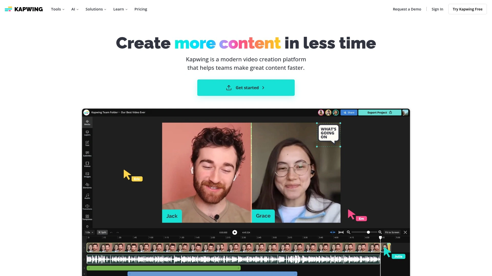

Kapwing is ridiculously easy to use—seriously, if you can drag things around on your screen, you can edit videos here. The platform focuses on social media content creation with built-in meme generators, text overlays, and transition options that make your clips feel native to each platform.

Teams appreciate Kapwing's collaborative features: multiple users can work on projects simultaneously, and the platform offers unlimited storage on paid plans. You can also edit videos by editing text, similar to Descript, which speeds up the process significantly.

Kapwing offers a free tier, with the Pro plan at $24/month and custom pricing for Enterprise. The tool supports exports up to 1080p and works on any device via web browsers, including Windows, Mac, iOS, and Android. Best suited for content creators, small teams, and anyone who needs quick social media edits without complexity.

***

## **[Lumen5](https://lumen5.com)**

**AI turns blog posts into videos with smart content suggestions and customizable templates.**

Lumen5 is the go-to platform for turning written content into video. Paste a blog post, article, or script, and Lumen5's AI automatically converts it into an engaging video with visuals, text overlays, and music. The platform suggests relevant stock footage and images based on your content's keywords, making video creation genuinely fast.

The interface is user-friendly with a drag-and-drop editor and ready-made templates aligned with your brand colors, fonts, and logo. Lumen5 provides access to millions of royalty-free images, video clips, and music tracks from its stock media library. You can easily switch videos between wide, square, and tall formats to suit different social platforms like YouTube, Instagram, and TikTok.

Lumen5's Basic plan starts at $29/month, with Starter at $79/month, Professional at $199/month, and custom pricing for Enterprise. It's especially valuable for bloggers, SaaS brands, and marketers who want to repurpose existing written content into video format without starting from scratch.

---

## **[Submagic](https://www.submagic.co)**

Engaging subtitle specialist with animated captions, emoji generators, and B-roll insertion.

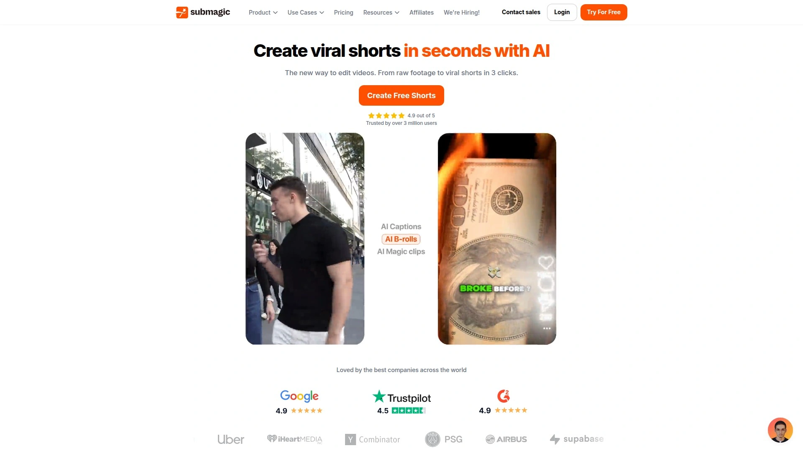

Submagic built its reputation on making captions look good—like, genuinely attention-grabbing. The platform automatically generates stylized, animated subtitles in 48+ languages with 99% accuracy, ideal for the massive audience that watches videos on mute. But it goes beyond subtitles: Submagic's Magic Clips feature uses AI to select standout moments from longer content and turns them into viral-ready shorts with one click.

The tool auto-inserts relevant stock footage, emojis, GIFs, transitions, and sound effects to keep viewers engaged. You can also translate captions into 100+ languages in one click, making it easy to localize content for global audiences. Submagic offers full customization over font, text placement, framing, caption style, and colors, with reusable brand templates.

Pricing starts at $29/month for Starter, $99/month for Professional, and $299/month for Enterprise. Social media marketers, agencies, and YouTube creators use Submagic to produce polished, engaging short-form content at scale.

***

## **[InVideo](https://invideo.io)**

**Text-to-video AI generator with 7,000+ templates and 16M+ stock media library.**

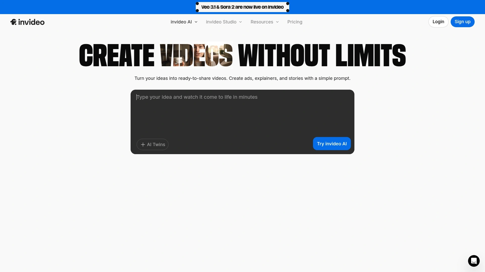

InVideo lets you create fully produced videos from simple text prompts—paste your script or topic, and the AI auto-generates a video complete with visuals, voiceover, captions, and music. The platform offers over 7,000 professionally designed templates with transitions, stickers, and support for iStock, Shutterstock, and Storyblocks assets.

InVideo's AI-powered voiceovers work in 50+ languages with customizable AI presenters, bringing videos to life without needing voice talent. The 16 million+ royalty-free stock media library means you'll always find matching visuals for your content. One-click resizing automatically adjusts videos for different formats, perfect for distributing across multiple platforms.

The platform is designed for speed and scale—marketing teams can quickly churn out social-ready videos without production resources or editing skills. However, users note some upload lag and browser-based performance issues, and watermarks apply on the free plan. InVideo is best for teams that need good-looking social videos fast, especially for short-form content.

***

## **[Vizard.ai](https://vizard.ai)**

**AI video clipping tool with frame extraction and engagement-driven editing for social content.**

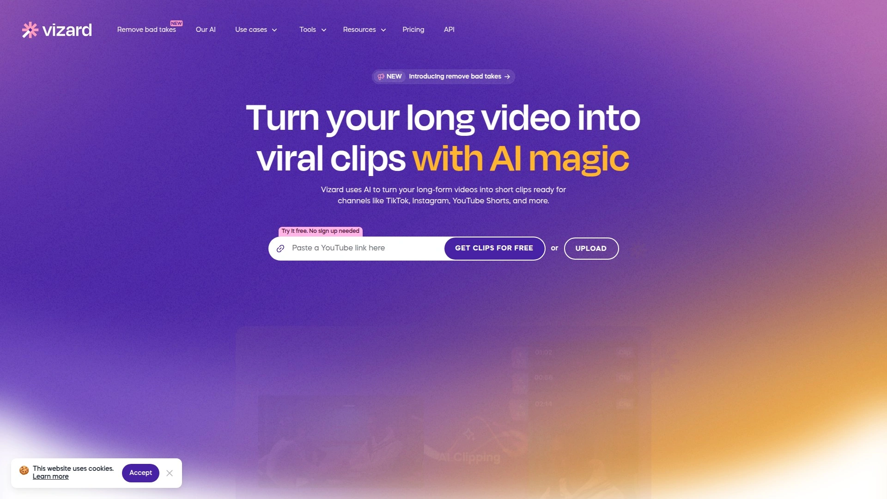

Vizard turns long-form videos into engaging viral clips with just a few clicks. The AI clipping feature automatically detects engaging moments in your videos and cuts them into shorter, platform-optimized segments. Vizard leans on speaker detection and timestamp-based segmentation for quick turnarounds, though some users find they need to make manual adjustments for context.

The platform includes auto-caption generation, formatting for vertical video, and basic styling presets to match your brand. Vizard's frame extraction feature is particularly useful—it lets you pull still images from spike moments in your content, typically the seconds where speakers emphasize key points.

Vizard works well for one-video-at-a-time workflows and focuses on helping creators repurpose podcast episodes, webinars, and interviews into social-ready clips. During testing, reviewers found Vizard and Descript performed best overall among AI video repurposing tools for podcasters.

***

## **[Klap](https://klap.app)**

**Content-intent focused AI that evaluates sentence meaning and emotional tone for smarter clip selection.**

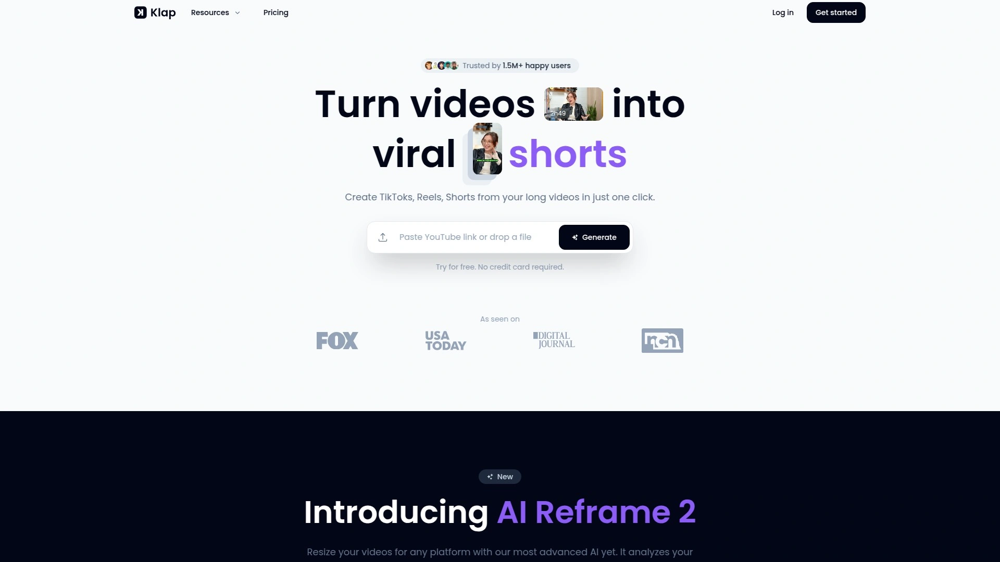

Klap takes a different approach to clipping by analyzing content intent rather than just speaker cues. The algorithm evaluates sentence meaning, delivery pace, topic shifts, and emotional tone to find segments that work as standalone short-form content. This results in more usable clips with less manual correction compared to timestamp-only tools.

Klap allows full customization over font, text placement, framing, caption style, and colors—you can apply brand kits and reuse templates across uploads. The platform offers AI-powered dubbing in 29 languages with synthesized voices that match speech timing and pacing, making it easy to localize content for international audiences.

The tool supports high-volume workflows with uploads of up to 100 videos per month and generation of up to 1,000 clips, with each input up to 3 hours long. Klap integrates scheduling across social platforms, letting you process, edit, and schedule within the same interface. Over 1 million users trust Klap for creating smarter clips at scale.

***

## **[Wisecut](https://www.wisecut.ai)**

**Automatic editor that removes filler words, adds smart cuts, and harmonizes background music.**

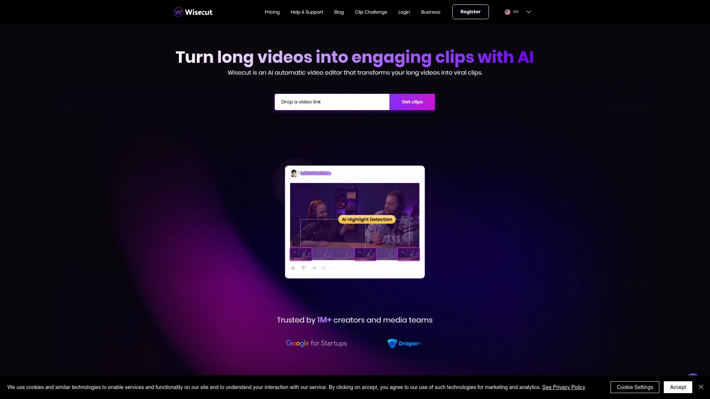

Wisecut uses AI and voice recognition to edit videos automatically—it identifies and removes long pauses, creates jump cuts, fine-tunes audio balance, incorporates background music, and generates subtitles with auto-translation. The tool excels at helping vloggers and freelancers minimize editing time while maximizing content creation.

The storyboard-based editing interface lets you make tweaks by moving around transcribed text and scenes—no keyframes, no complex timelines, no video editing skills needed. Wisecut's audio ducking feature automatically lowers background music volume when you speak and increases it during silent moments, maintaining harmonious audio balance.

Wisecut provides detailed reports showing how your edits are shaping up, including insights into moments of silence the AI has worked on. The platform offers a free tier with paid plans starting at $15/month. Trusted by over 1 million creators and media teams, Wisecut is particularly useful for turning long videos into engaging clips with smooth flow.

***

## **[ContentFries](https://www.contentfries.com)**

**Multiplier tool that turns 1 video into 15+ platform-ready clips with subtitle and progress bar features.**

ContentFries is all about multiplication—upload one video and walk away with 15 or more platform-ready clips. The tool automatically adds subtitles, progress bars, images, logos, and text overlays to make your clips feel polished and professional.

ContentFries focuses on helping coaches and speakers scale their content output without hiring editors or spending hours in post-production. The platform handles the repetitive tasks of clipping, resizing, and branding so you can focus on creating more content.

Pricing starts at just $10/month, making it one of the most affordable options for consistent content repurposing. The tool works well for anyone who needs to maintain a steady stream of social media content from limited source material.

***

## **[Repurpose.io](https://repurpose.io)**

**Automated workflow builder that auto-publishes video content across multiple social channels.**

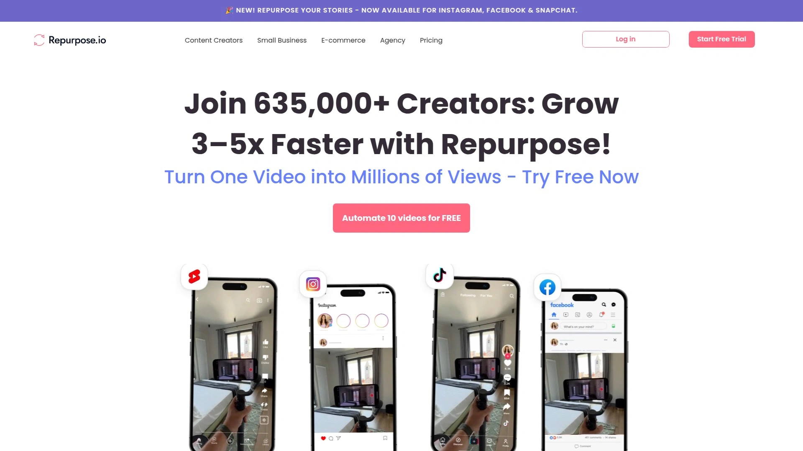

Repurpose.io takes a workflow-first approach to content repurposing. The platform focuses on automating the distribution process—post content once on one social media channel, and Repurpose.io automatically repurposes that content into posts optimized for all other channels you use.

The tool resizes videos for different channel requirements (horizontal vs. vertical formats) at the click of a button and includes custom templates you can customize to align with your brand. Repurpose.io is designed primarily for social media creators and businesses with a presence on multiple channels like TikTok, YouTube, LinkedIn, Instagram, and Threads.

Pricing includes a Content Marketer package at $35/month for up to 5 of each social media channel, and an Agency package at $149/month for up to 20 of each channel. Users highlight the positive impact and great customer support, though some mention difficulty canceling once committed. The platform is ideal for course creators, coaches, and agencies managing social media for multiple clients.

---

## **[Recast Studio](https://recast.studio)**

**AI-powered editor with branded templates and auto-resize for marketing teams with no editing skills.**

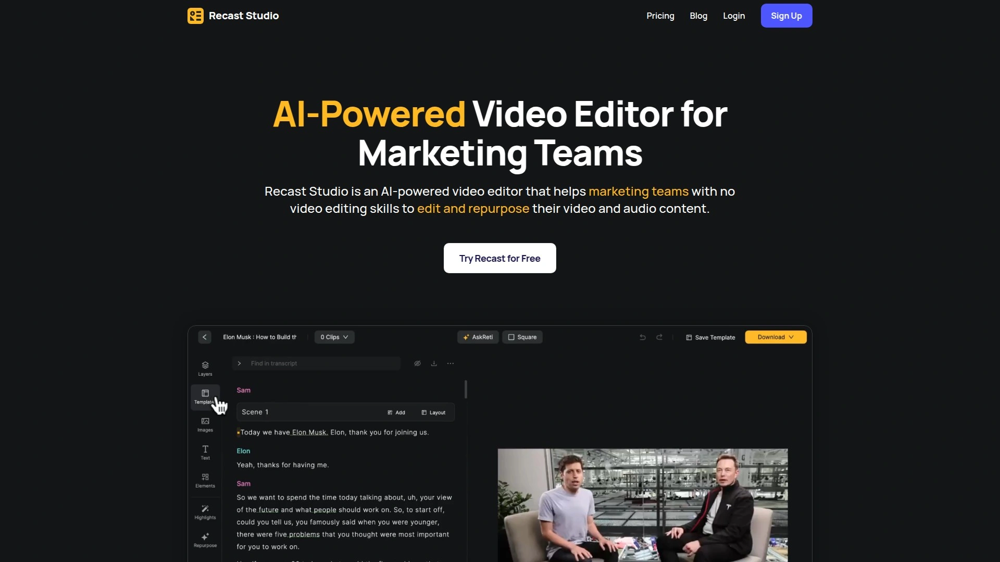

Recast Studio specifically targets marketing teams who lack video editing skills but need professional output. The platform automatically turns videos and podcasts into short video clips and simultaneously generates show notes, blog posts, and social media captions.

The tool provides branded templates with auto-resize functionality, making it easy to maintain consistent visual identity across all social platforms. Recast Studio handles the entire repurposing workflow from editing to content generation in one place.

Pricing starts at $10/month, offering solid value for teams on tight budgets. Recast Studio works particularly well for marketing teams managing regular podcast or video series who need to maximize content output without expanding their team.

***

## **[Synthesia](https://www.synthesia.io)**

**AI avatar-driven video platform for creating professional training and explainer videos at scale.**

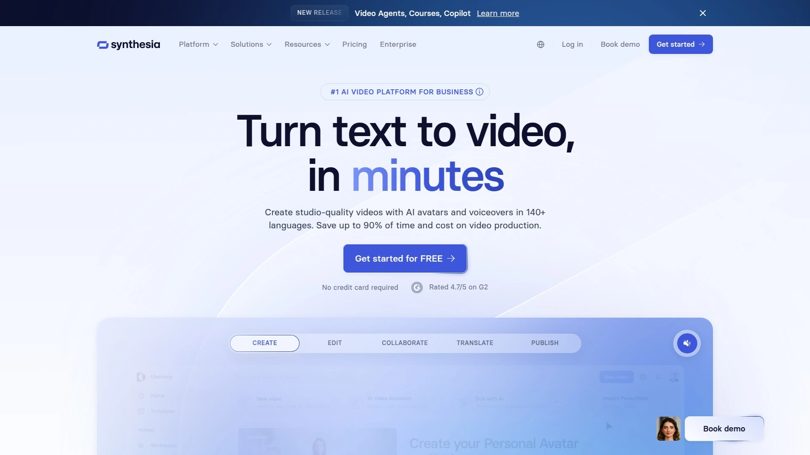

Synthesia stands apart from typical repurposing tools by focusing on creating new videos with AI avatars. You can choose from a diverse cast of realistic AI avatars or even create a custom avatar to represent your brand. The platform turns text scripts into fully produced videos with AI presenters, making it ideal for training videos, product demos, and explainer content.

Synthesia offers over 25 video tools including text-to-video generation, digital human creation, AI video editing, and subtitle addition in 39+ languages. The platform provides a wider variety of templates and more extensive library of high-quality stock footage compared to simpler repurposing tools.

While Synthesia has a slightly steeper learning curve than tools focused purely on clipping, it gives users more control over the final look of their videos. The platform is best for businesses, educators, and marketing teams creating professional videos at scale without needing on-camera talent.

---

## **[Captions](https://mirage.app/captions)**

**All-in-one AI video generator that creates fully-edited videos from text commands and selfies.**

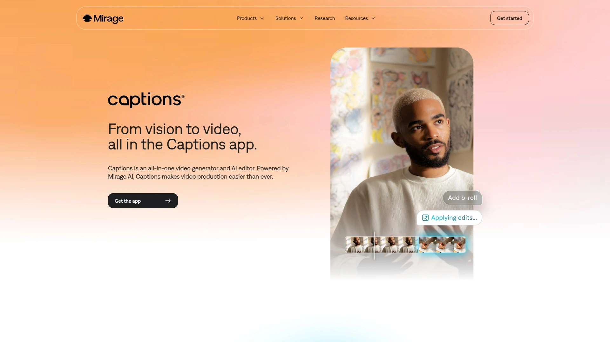

Captions, powered by Mirage AI, is an all-in-one video generator and editor that produces fully-edited videos from simple text commands. The platform's unique "AI twin" feature lets you generate an unlimited creative variations from a single selfie—you can easily change outfits, settings, and other details without reshooting.

The conversational editor works like a chat interface where you type editing ideas and Mirage's AI executes them—it can add music, change timing, swap aesthetics, and handle both minor adjustments and abstract requests. Captions is trained on the style and pacing of short-form social videos, so your output naturally fits platforms like TikTok and Instagram Reels.

Captions excels at speed and simplicity with an intuitive interface that makes it incredibly easy to generate videos even with no prior editing experience. The platform is best for creators who want scroll-stopping social content fast without DIY complexity. Unlike Synthesia, Captions prioritizes quick turnaround over extensive template libraries, making it ideal for high-volume social media content creation.

***

## FAQ

**How do AI video repurposing tools identify the best clips to extract?**

Most AI repurposing tools analyze speech patterns, pauses, audience engagement data, and keyword density to identify compelling moments. Advanced platforms like Munch and Opus Clip cross-reference your content with social media trends and assign virality scores to predict performance. Tools like Klap go further by evaluating emotional tone and content intent to select segments that work as standalone clips.

**Can these tools handle multiple languages and international audiences?**

Yes, many repurposing platforms support multilingual content. Munch handles over 10 languages including Spanish, German, Hindi, and Japanese. Submagic generates captions in 48+ languages with 99% accuracy and translates them into 100+ languages. Klap offers AI-powered dubbing in 29 languages with synthesized voices that match your speech timing. InVideo provides voiceovers in 50+ languages.

**What's the difference between repurposing tools and traditional video editors?**

Traditional editors like Adobe Premiere require manual timeline editing, keyframe adjustments, and technical skills. Repurposing tools automate the heavy lifting—they automatically detect highlights, add captions, apply smart cropping, and generate multiple clips with one click. Tools like Descript and Wisecut use storyboard editing where you edit by manipulating text rather than video timelines. The goal is to turn one hour of editing into 10 minutes.

***

## Conclusion

If you're trying to stretch one video into a month of social content, these AI repurposing tools are your shortcut to staying consistent without burning out. Each platform tackles the problem differently—some prioritize speed, others focus on customization, and a few offer end-to-end workflows that handle everything from clipping to scheduling. The best choice depends on your content type, publishing frequency, and how much control you want over the final output.

For most creators and teams, **[Munch](https://www.getmunch.com)** hits the sweet spot because it combines smart AI clipping with engagement analytics and social post generation, making it genuinely useful for growing your reach across platforms. Whether you're repurposing podcasts, webinars, or YouTube videos, the right tool transforms your content from a one-time upload into an ongoing conversation with your audience.
